邱瑞鸿 /`ray hong chill/

I am currently an Assistant Professor and an ARC DECRA fellow (2025-2028) in <a href="https://eecs.uq.edu.au/" target="_blank"> School of Electrical Engineering and Computer Science (EECS)</a> at <a href="https://www.uq.edu.au" target="_blank"> The University of Queensland (UQ)</a>. Here is my short <a href="./bio">bio</a>.

My research focuses on data science methods, including theory and application in:
1. **Graph Foundation Models**. Text-attributed graph and multimodal graph with (M)LLMs; General graph foundation models and adaptation etc.
2. **Information Retrieval**. (M)LLMs in IR/RecSys.
3. **RL Tuning in LLMs**. Reasoning, post-training of (D)LLMs.

Recruitment
=====
I am actively looking for **(1-2) self-motivated PhD students in Year 2026, all fully funded!**
* <a href="./recruit-phd">[For prospective PhD students]</a> <a href="./recruit-phd-cn">/ [博士招生中文]</a>.
* <a href="./recruit-thesis">[For master thesis, bachelor honours or Summer/Winter Research students at UQ]</a>.
* <a href="./recruit-intern">[For interns / visitors]</a>.

Recent News
=====
* 10.2025 Our paper, "Beyond Static LLM Policies: Imitation-Enhanced Reinforcement Learning for Recommendation" is selected as Best Paper Finalist, ICDM 2025.

* 08.2024 ARC DECRA project funded, "Lifelong Paradigms for Versatile, Robust and Agile Recommender Systems" (2025-2028)

* 06.2024 Our team gives a talk, "Effective Representation Learning for Legal Case Retrieval", at IR Seminar, the University of Glasgow. [\[slides\]](../files/LCR_THUIR.pdf){:target="_blank"}

* 05.2024 Our team gives a talk, "Effective Representation Learning for Legal Case Retrieval", at THUIR, Tsinghua University. [\[slides\]](../files/LCR_THUIR.pdf){:target="_blank"}

* 03.2024 Give a talk, "Graph Learning Methods in Session-based Recommendations and Legal Case Retrieval", at [IRonGraphs Workshop at ECIR 2024](https://irongraphs.github.io/ecir2024/){:target="_blank"}. [\[slides\]](../files/GraphIR_IRonGraph_ECIR.pdf){:target="_blank"}
*  <a href="./past-news">Past news</a>

Selected Research
=====
<a href="https://scholar.google.com/citations?user=zbRZyuEAAAAJ" target="_blank">Google Scholar</a> page includes the full publication list.

## Out-of-distribution on Graphs

<table style="width:100%;border:0px;border-spacing:0px;border-collapse:separate;margin-right:auto;margin-left:auto;font-size:1em;"><tbody>
          <tr>
            <td style="padding:0 12px 0 0;width:25%;vertical-align:middle">
              
            </td>
            <td width="75%" valign="middle">
              <strong>Text Meets Topology: Rethinking Out-of-distribution Detection in Text-Rich Networks</strong>
               
              Danny Wang, <strong>Ruihong Qiu</strong>, Guangdong Bai, Zi Huang
               
              EMNLP 2025 (<strong>Main</strong>)
               
            <a href="https://arxiv.org/abs/2508.17690" target="_blank">arXiv</a> /
              <a href="https://github.com/DannyW618/TNT" target="_blank">code</a>
              

              

              

                We introduce TextTopoOOD, a framework for modeling diverse OOD scenarios on text-rich networks, and propose TNT-OOD, a novel detection method that captures the intricate interplay between text and topology.
              

            </td>
          </tr>
          <tr>
            <td style="padding:0 12px 0 0;width:25%;vertical-align:middle">
              
            </td>
            <td width="75%" valign="middle">
              <strong>GOLD: Graph Out-of-Distribution Detection via Implicit Adversarial Latent Generation</strong>
               
              Danny Wang, <strong>Ruihong Qiu</strong>, Guangdong Bai, Zi Huang
               
              ICLR 2025 (<strong>Spotlight</strong>)
               
            <a href="https://arxiv.org/abs/2502.05780" target="_blank">arXiv</a> / <a href="https://openreview.net/forum?id=y5einmJ0Yx" target="_blank">OpenReview</a> /
              <a href="https://github.com/DannyW618/GOLD" target="_blank">code</a>
              

              

              

                We propose the GOLD framework for graph OOD detection, an implicit adversarial learning pipeline with synthetic OOD exposure without pre-trained models.
              

            </td>
          </tr>
          <tr>
            <td style="padding:0 12px 0 0;width:25%;vertical-align:middle">
              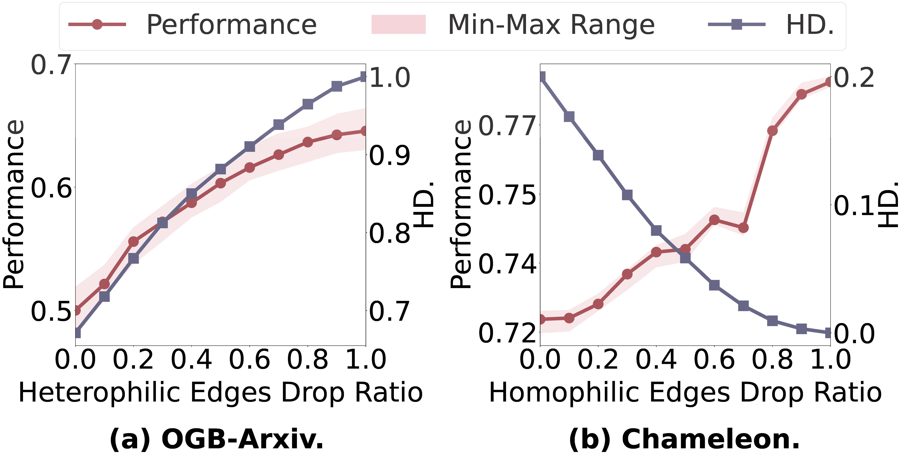
            </td>
            <td width="75%" valign="middle">
              <strong>Does Homophily Help in Robust Test-time Node Classification?</strong>
               
              Yan Jiang, <strong>Ruihong Qiu</strong>, Zi Huang
               
              WSDM 2026 (<strong>Oral</strong>)
               
            <a href="https://arxiv.org/abs/2510.22289" target="_blank">arXiv</a> /
              <a href="https://github.com/YanJiangJerry/GrapHoST" target="_blank">code</a>
              

              

              

                We propose the GrapHoST framework for graph learning to conduct test-time graph transformation based on homophily to enhance the robustness of graph models.
              

            </td>
          </tr>
</tbody>
</table>

## Graph Condensation

<table style="width:100%;border:0px;border-spacing:0px;border-collapse:separate;margin-right:auto;margin-left:auto;font-size:1em;"><tbody>
          <tr>
            <td style="padding:0 12px 0 0;width:25%;vertical-align:middle">
              
            </td>
            <td width="75%" valign="middle">
              <strong>GCondenser: Benchmarking Graph Condensation</strong>
               
              Yilun Liu, <strong>Ruihong Qiu</strong>, Zi Huang
               
              CIKM 2025
               
              <a href="https://arxiv.org/abs/2405.14246" target="_blank">arXiv</a> /
              <a href="https://github.com/superallen13/GCondenser" target="_blank">code</a>
              

              

              

                We introduce a benchmark for graph condensation with a thorough methodology development method and an extensive evaluation protocol.
              

            </td>
          </tr>
          <tr>
            <td style="padding:0 12px 0 0;width:25%;vertical-align:middle">
              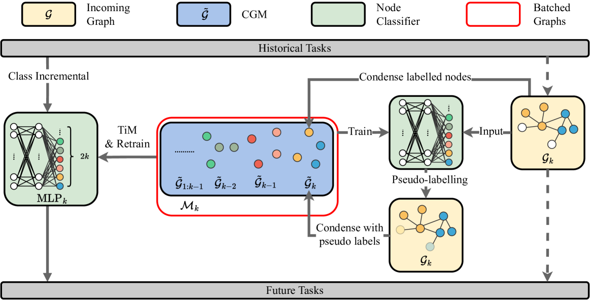
            </td>
            <td width="75%" valign="middle">
              <strong>PUMA: Efficient Continual Graph Learning with Graph Condensation</strong>
               
              Yilun Liu, <strong>Ruihong Qiu</strong>, Yanran Tang, Hongzhi Yin, Zi Huang
               
              TKDE 2024
               
              <a href="https://arxiv.org/abs/2312.14439" target="_blank">arXiv</a> /
              <a href="https://github.com/superallen13/PUMA" target="_blank">code</a>
              

              

              

                We extend the Condense-and-Train (CaT) continual graph learning algorithm with a more efficient and effective, psudo-label guided memory bank (PUMA🐆) framework.
              

            </td>
          </tr>
          <tr>
            <td style="padding:0 12px 0 0;width:25%;vertical-align:middle">
              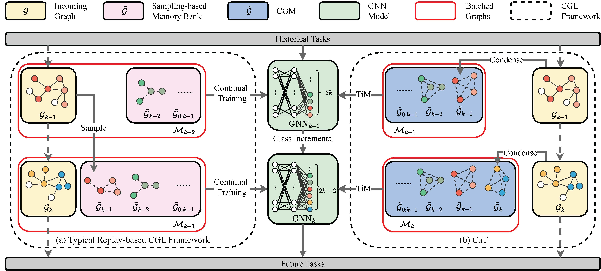
            </td>
            <td width="75%" valign="middle">
              <strong>CaT: Balanced Continual Graph Learning with Graph Condensation</strong>
               
              Yilun Liu, <strong>Ruihong Qiu</strong>, Zi Huang
               
              ICDM 2023
               
              <a href="https://arxiv.org/abs/2309.09455" target="_blank">arXiv</a> /
              <a href="https://github.com/superallen13/CaT-CGL" target="_blank">code</a>
              

              

              

                We introduce a Condense-and-Train (CaT🐱) memory-based continual graph learning algorithm using graph condensation to construct a more representative memory bank. And a Train-in-Memory continual learning scheme can further alleviate the imbalanced training issue in Class Incremental Learning.
              

            </td>
          </tr>
</tbody>
</table>

## Legal Case Retrieval

<table style="width:100%;border:0px;border-spacing:0px;border-collapse:separate;margin-right:auto;margin-left:auto;font-size:1em;"><tbody>
          <tr>
            <td style="padding:0 12px 0 0;width:25%;vertical-align:middle">
              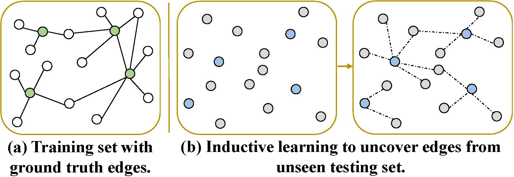
            </td>
            <td width="75%" valign="middle">
              <strong>CaseLink: Inductive Graph Learning for Legal Case Retrieval</strong>
               
              Yanran Tang, <strong>Ruihong Qiu</strong>, Hongzhi Yin, Xue Li, Zi Huang
               
              SIGIR 2024
               
              <a href="https://arxiv.org/abs/2403.17780" target="_blank">arXiv</a> /
              <a href="https://github.com/yanran-tang/CaseLink" target="_blank">code</a>
              

              

              

                We introduce an inductive graph learning paradigm for legal case retrieval to tackle the challenge of unseen testing query and candidate cases.
              

            </td>
          </tr>
          <tr>
            <td style="padding:0 12px 0 0;width:25%;vertical-align:middle">
              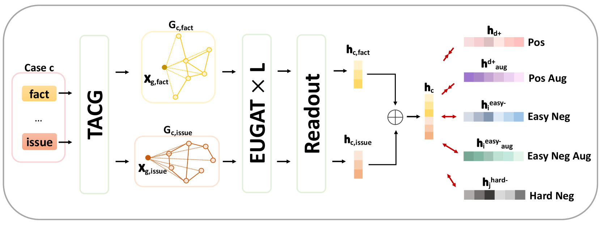
            </td>
            <td width="75%" valign="middle">
              <strong>CaseGNN++: Graph Contrastive Learning for Legal Case Retrieval with Graph Augmentation</strong>
               
              Yanran Tang, <strong>Ruihong Qiu</strong>, Yilun Liu, Xue Li, Zi Huang
               
              TOIS 2024 (under review)
               
              <a href="https://arxiv.org/abs/2405.11791" target="_blank">arXiv</a> /
              <a href="https://github.com/yanran-tang/CaseGNN" target="_blank">code</a>
              

              

              

                We introduce an extended CaseGNN++ method with graph augmentations based on the CaseGNN framework.
              

            </td>
          </tr>
          <tr>
            <td style="padding:0 12px 0 0;width:25%;vertical-align:middle">
              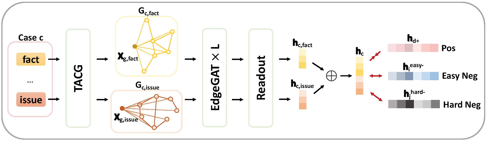
            </td>
            <td width="75%" valign="middle">
              <strong>CaseGNN: Graph Neural Networks for Legal Case Retrieval with Text-Attributed Graphs</strong>
               
              Yanran Tang, <strong>Ruihong Qiu</strong>, Yilun Liu, Xue Li, Zi Huang
               
              ECIR 2024
               
              <a href="https://arxiv.org/abs/2312.11229" target="_blank">arXiv</a> /
              <a href="https://github.com/yanran-tang/CaseGNN" target="_blank">code</a>
              

              

              

                We introduce a structural modelling of law case for effective retrieval with the aid of summarisation from LLM and grpah neural networks.
              

            </td>
          </tr>
</tbody>
</table>

## Recommender Systems

<table style="width:100%;border:0px;border-spacing:0px;border-collapse:separate;margin-right:auto;margin-left:auto;font-size:1em;"><tbody>
          <tr>
            <td style="padding:0 12px 0 0;width:25%;vertical-align:middle">
              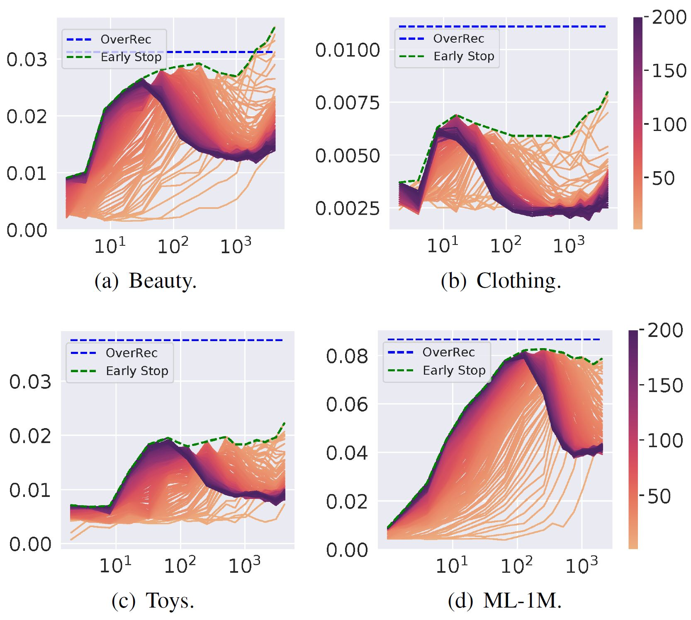
            </td>
            <td width="75%" valign="middle">
              <strong>Beyond Double Ascent via Recurrent Neural Tangent Kernel in Sequential Recommendation</strong>
               
              <strong>Ruihong Qiu</strong>, Zi Huang, Hongzhi Yin
               
              ICDM 2022
               
              <a href="https://arxiv.org/abs/2209.03735" target="_blank">arXiv</a> /
              <a href="https://github.com/RuihongQiu/OverRec" target="_blank">code</a> /
              <a href="https://www.youtube.com/watch?v=_jtvL4ROmq0&ab_channel=RuihongQiu" target="_blank">video</a>
              

              

              

                We introduce shared input-output embedding Recurrent Neural Tangent Kernel to sequential recommendation (OverRec). 
              

            </td>
          </tr>
          <tr>
            <td style="padding:0 12px 0 0;width:25%;vertical-align:middle">
              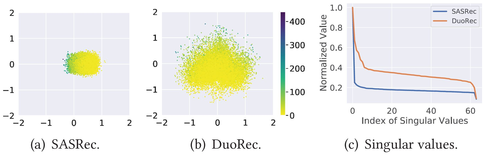
            </td>
            <td width="75%" valign="middle">
              <strong>Contrastive Learning for Representation Degeneration Problem in Sequential Recommendation</strong>
               
              <strong>Ruihong Qiu</strong>, Zi Huang, Hongzhi Yin, Zijian Wang
               
              WSDM 2022
               
              <a href="https://arxiv.org/abs/2110.05730" target="_blank">arXiv</a> /
              <a href="https://github.com/RuihongQiu/DuoRec" target="_blank">code</a>
              

              

              

                We discover and find the cause of representation degeneration problem in sequential recommendation (DuoRec). A contrastive learning regularisation is applied to enforce the distribution to be uniform.
              

            </td>
          </tr>
          <tr>
            <td style="padding:0 12px 0 0;width:25%;vertical-align:middle">
              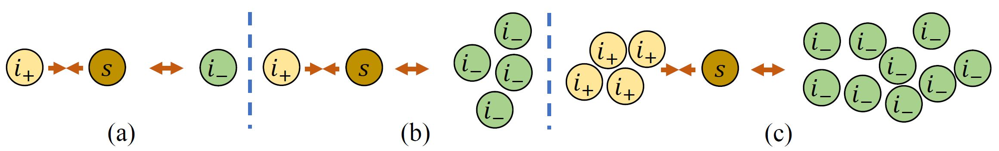
            </td>
            <td width="75%" valign="middle">
              <strong>Memory Augmented Multi-Instance Contrastive Predictive Coding for Sequential Recommendation</strong>
               
              <strong>Ruihong Qiu</strong>, Zi Huang, Hongzhi Yin
               
              ICDM 2021
               
              <a href="https://arxiv.org/abs/2109.00368" target="_blank">arXiv</a> /
              <a href="https://github.com/RuihongQiu/MMInfoRec" target="_blank">code</a> /
              <a href="https://www.youtube.com/watch?v=n32W2HAJrgQ&ab_channel=UQMMLab" target="_blank">video</a>
              

              

              

                We introduce multi-instance NCE loss to enhance the side-information based item representation learning (MMInfoRec) in sequential recommendation. 
              

            </td>
          </tr>
          <tr>
            <td style="padding:0 12px 0 0;width:25%;vertical-align:middle">
              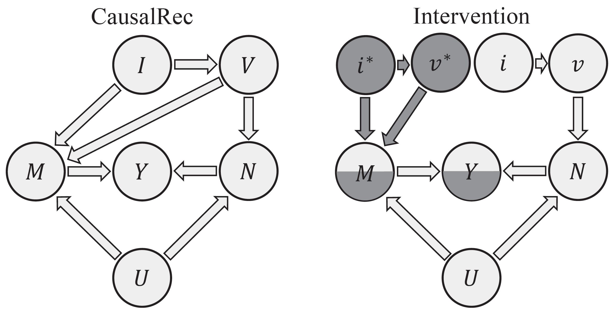
            </td>
            <td width="75%" valign="middle">
              <strong>CausalRec: Causal Inference for Visual Debiasing in Visually-Aware Recommendation</strong>
               
              <strong>Ruihong Qiu</strong>, Sen Wang, Zhi Chen, Hongzhi Yin, Zi Huang
               
              ACM MM 2021 (oral)
               
              <a href="https://arxiv.org/abs/2107.02390" target="_blank">arXiv</a> /
              <a href="https://github.com/RuihongQiu/cornac/tree/master/cornac/models/causalrec" target="_blank">code</a> /
              <a href="https://www.youtube.com/watch?v=IIok9qC6aFg&ab_channel=UQMMLab" target="_blank">video</a>
              

              

              

                We introduce a structural causal graph to debias the visual bias in item recommendation (CausalRec). 
              

            </td>
          </tr>
          <tr>
            <td style="padding:0 12px 0 0;width:25%;vertical-align:middle">
              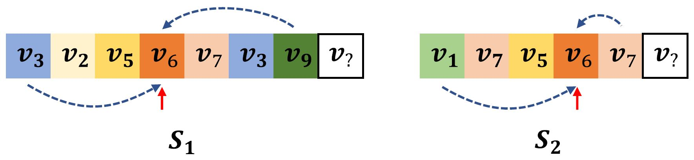
            </td>
            <td width="75%" valign="middle">
              <strong>Exploiting Positional Information for Session-based Recommendation</strong>
               
              <strong>Ruihong Qiu</strong>, Zi Huang, Tong Chen, Hongzhi Yin
               
              TOIS 2021
               
              <a href="https://arxiv.org/abs/2107.00846" target="_blank">arXiv</a>
              

              

              

                We introduce a dual positional encoding to theoretically characterise and represent the positional information (PosRec) in session-based recommendation. 
              

            </td>
          </tr>
          <tr>
            <td style="padding:0 12px 0 0;width:25%;vertical-align:middle">
              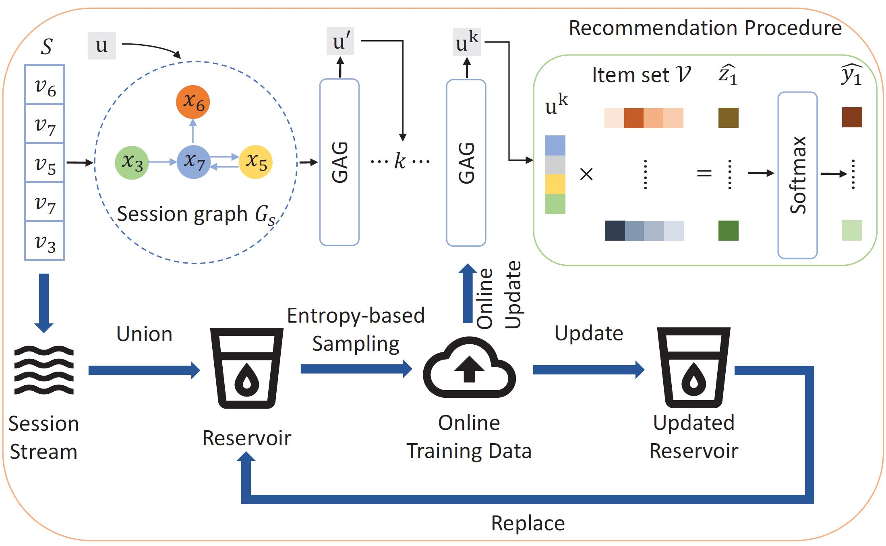
            </td>
            <td width="75%" valign="middle">
              <strong>GAG: Global Attributed Graph Neural Network for Streaming Session-based Recommendation</strong>
               
              <strong>Ruihong Qiu</strong>, Hongzhi Yin, Zi Huang, Tong Chen
               
              SIGIR 2020
               
              <a href="https://arxiv.org/abs/2007.02747" target="_blank">arXiv</a> /
              <a href="https://github.com/RuihongQiu/GAG" target="_blank">code</a> /
              <a href="https://www.youtube.com/watch?v=aFAMadUTsF0&ab_channel=UQMMLab" target="_blank">video</a>
              

              

              

                We introduce a global attributed graph (GAG) neural network for streaming session-based recommendation. 
              

            </td>
          </tr>
          <tr>
            <td style="padding:0 12px 0 0;width:25%;vertical-align:middle">
              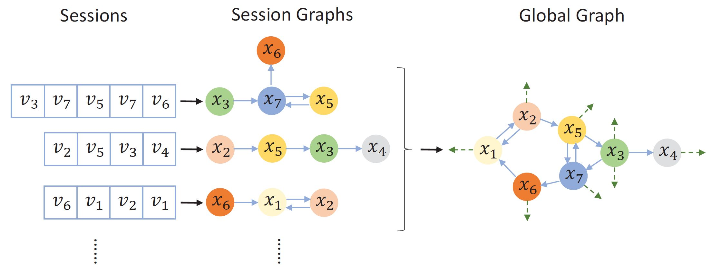
            </td>
            <td width="75%" valign="middle">
              <strong>Exploiting Cross-session Information for Session-based Recommendation with Graph Neural Networks</strong>
               
              <strong>Ruihong Qiu</strong>, Jingjing Li, Zi Huang, Hongzhi Yin
               
              TOIS 2020
               
              <a href="https://arxiv.org/abs/2107.00852" target="_blank">arXiv</a>
              

              

              

                We introduce a global graph to model cross session information in session-based recommendation. 
              

            </td>
          </tr>
          <tr>
            <td style="padding:0 12px 0 0;width:25%;vertical-align:middle">
              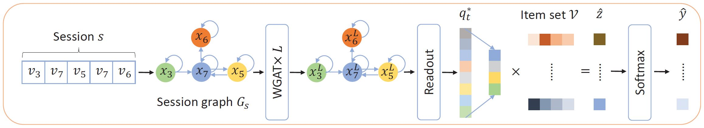
            </td>
            <td width="75%" valign="middle">
              <strong>Rethinking the Item Order in Session-based Recommendation with Graph Neural Networks</strong>
               
              <strong>Ruihong Qiu</strong>, Jingjing Li, Zi Huang, Hongzhi Yin
               
              CIKM 2019
               
              <a href="https://arxiv.org/abs/1911.11942" target="_blank">arXiv</a> /
              <a href="https://github.com/RuihongQiu/FGNN" target="_blank">code</a>
              

              

              

                We introduce a Full Graph Neural Network (FGNN) for to model a session as graph in session-based recommendation. 
              

            </td>
          </tr>
</tbody>
</table>

## Water Management with Data Science

<table style="width:100%;border:0px;border-spacing:0px;border-collapse:separate;margin-right:auto;margin-left:auto;font-size:1em;"><tbody>
          <tr>
            <td style="padding:0 12px 0 0;width:25%;vertical-align:middle">
              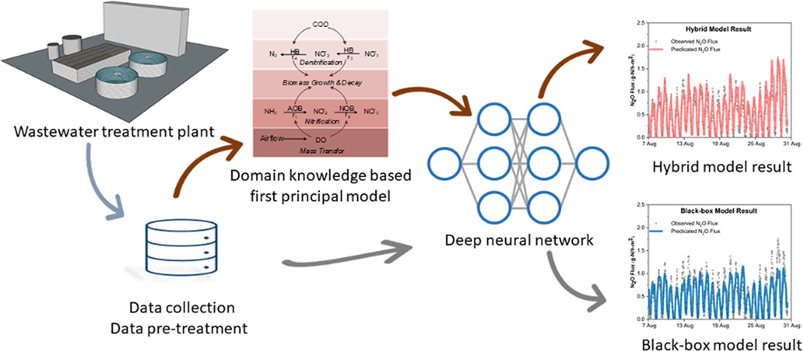
            </td>
            <td width="75%" valign="middle">
              <strong>An integrated first principal and deep learning approach for modeling nitrous oxide emissions from wastewater treatment plants</strong>
               
              Kaili Li, Haoran Duan, Linfeng Liu, <strong>Ruihong Qiu</strong>, Ben van den Akker, Bing-Jie Ni, Tong Chen, Hongzhi Yin, Zhiguo Yuan, Liu Ye
               
              Environmental Science & Technology 2022
               
              <a href="https://pubs.acs.org/doi/pdf/10.1021/acs.est.1c05020" target="_blank">PDF</a>
              

              

              

                We use sequential modelling in deep learning to predict the amount of emitted N2O with green-house effect.
              

            </td>
          </tr>
</tbody>
</table>

Team
=====
* Boyu Luo, UQ EECS PhD (7.2024-, co-advise with Helen Huang and Guangdong Bai)
* Yi Zhang, UQ EECS PhD (7.2024-, co-advise with Sen Wang and Jiajun Liu)
* <a href="https://yanjiangjerry.github.io/" target="_blank"> Yan Jiang</a>, UQ EECS PhD (1.2024-, co-advise with Helen Huang and Guangdong Bai)
* <a href="https://www.linkedin.com/in/danny-wang-374581217/" target="_blank"> Danny Wang</a>, UQ EECS PhD (1.2024-, co-advise with Helen Huang and Guangdong Bai)
* <a href="https://www.linkedin.com/in/hrishi-patel24/" target="_blank"> Hrishikesh Patel</a>, UQ EECS PhD (4.2023, co-advise with Sen Wang)
* <a href="https://www.linkedin.com/in/yilun-allen-liu-a6b7b7190/" target="_blank"> Yilun Liu</a>, UQ EECS PhD (1.2023-, co-advise with Helen Huang)
* <a href="https://acweb.uq.edu.au/profile/1183/jingyu" target="_blank"> Jingyu Ge</a>, UQ ACWEB PhD (1.2022-, co-advise with Zhiguo Yuan, Helen Huang, and Jiuling Li)

<!-- Teaching
=====
* <a href="https://course-profiles.uq.edu.au/student_section_loader/section_1/132419" target="_blank"> Social Analytics</a>, UQ BSAN7207 (Coordinator and Lecturer, Sem 1, 2024)
* <a href="https://course-profiles.uq.edu.au/student_section_loader/section_1/129831" target="_blank"> Introduction to Data Science</a>, UQ DATA7001 (Co-Coordinator and Lecturer, Sem 2, 2023 with Student Evaluation **4.6/5**; Sem 1, 2024) -->
<!-- * Data Mining, UQ INFS4203/7203 (Sem 2, 2022, Guest Lecturer) -->
<!-- * Data Mining, UQ INFS4203/7203 (Sem 2, 2021, TA) -->
<!-- * Cloud Computing, UQ INFS3208/7208 (Sem 2, 2020, TA) -->
<!-- * Cloud Computing, UQ INFS3208/7208 (Sem 2, 2019, TA) -->

Service
=====
* Conference organisation: Area Chair at <a href="http://tcci.ccf.org.cn/conference/2025/cfp.php" target="_blank"> NLPCC'25</a>; PhD Symposium Co-Chair at <a href="https://www2025.thewebconf.org/organizing-committee" target="_blank"> WWW'25</a>; Program Committee Co-Chair at <a href="https://adc2023.github.io/organisation" target="_blank"> ADC'23</a>; PhD Forum Co-Chair at <a href="https://ajcai2023.org/committee.html" target="_blank"> AJCAI'23</a>

<!-- * Reviewer: TKDE, TNNLS, TOIS, TPAMI, WWWJ
* PC member: ACML'20, AJCAI'23, CIKM'24'23'22'21'20, DASFAA'24'23, ICDE'20, ICDM'22'21, ICMR'23, IJCAI'24'23'20, SIGIR'24'23'20'19, SIGIR-AP'23, SIGMOD'20, VLDB'22'21, WSDM'23'22'21, WWW'25 -->

MISC
=====
I speak Cantonese, Mandarin and English.

Updated on 16/10/2025.

